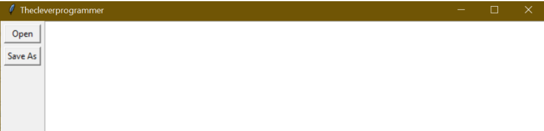

# Text-Editor-GUI-Python
A simple yet powerful Text Editor GUI built using Python Tkinter. Supports creating, opening, editing, and saving text files with responsive layout. Includes dedicated Save and Open buttons, a wide text area, and window resizing support. Perfect beginner-friendly GUI Python project.

## Features
- Create and edit text files
- Open existing text files
- Save text files with "Save As"
- Responsive window layout
- Minimum window height: 800px
- Minimum text area width: 800px
- Beginner friendly project

## Technologies Used
- Python
- Tkinter (Built-in Python GUI Library)

## Screenshot

## How It Works
We use Tkinter widgets:
- Two Button widgets → Open & Save
- One Text widget → To type & edit text
- Frame widget to hold buttons

The window layout is divided into:
- Left side → Buttons
- Right side → Text editor

The layout is responsive so when resizing the window, the text box resizes too.

## 🤝 Contribution
Feel free to fork, enhance and reuse this project!
